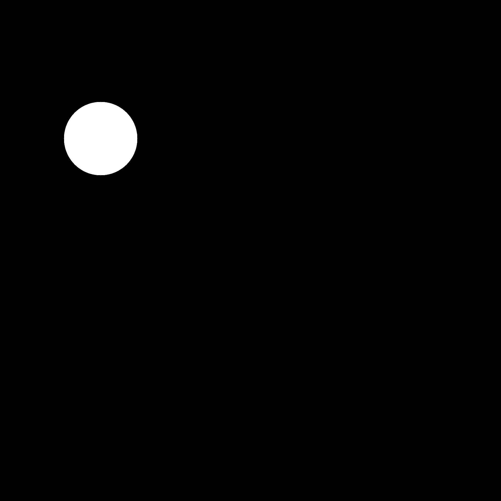
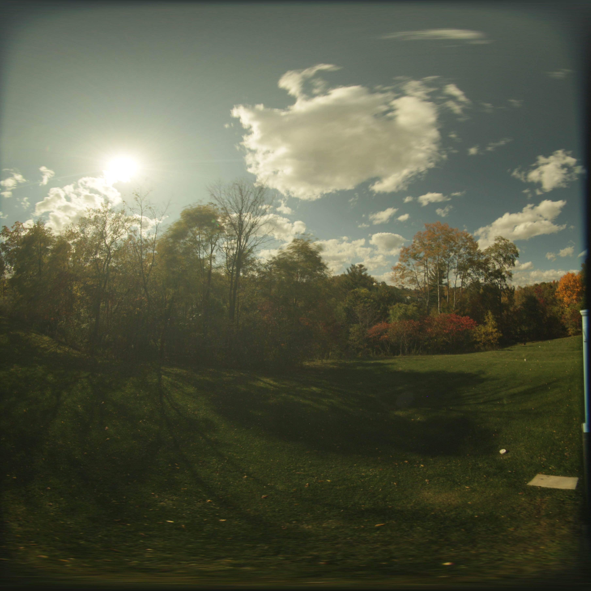
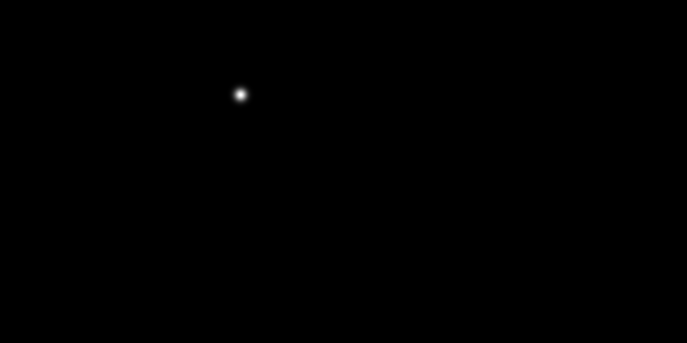

# edit_outdoor_sun_position
This respository describes the process for editing the outdoor sun in the captured fisheye image

# 00: Convert between Fisheye and Equirectanglar Image

run command: *python equ2sphere.py --task f2e --single_img_path $single_img_path$* to convert fisheye to equirectanglar image, or replace *f2e* to convert equirectanglar image to fisheye image.

# 01: Remove the Sun 

Use the sun theta (azi) and phi (alt) angle from [Local Sun Position](https://www.suncalc.org/#/27.6936,-97.5195,3/2024.01.23/16:05/1/3) and Building Orientaion measured from the room. 

run command: *python new_sun2circle.py --theta 194.87 --phi 40.31 --building_ori 264*

 

The generated mask *'sun_mask.png'* (left) will be paired with original image (right) to inpainting the sun and nearby region.

# 02: Add the Sun 

The generated mask *'sun2canvas.png'* shows the sun position (assuming when the sun is visible) in the equirectanglar coordinate. 

run command: *python new_sun2hdr.py --sun_mask_path $sun_mask_path$ --input_hdr $input_hdr$ --output_hdr $output_hdr$*

# 03: Generate the Sky

run command: *python new_sky.py* to generate new sky

